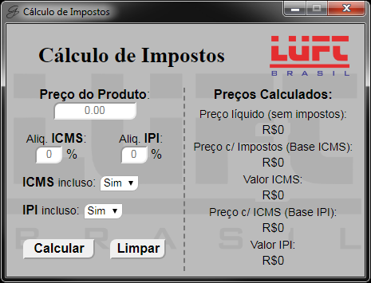
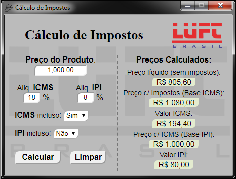

<h1 align="center">
    Cálculo Impostos
</h1>

<p> 
  <a href="https://www.linkedin.com/in/samueldelucca/">
    
  </a>
</p>

## :information_source: No que consiste o projeto?

Projeto desenvolvido com base na necessidade apresentada pelo setor de vendas da empresa.
Toda grande empresa, atualmente, trabalha com sistemas eletrônicos (Portais on-line) de inclusão de propostas/orçamentos.
Estes sistemas, em sua maioria, solicita a inclusão dos valores distrinchados com base nos impostos incidentes no preço dos produtos.


## 💻 Projeto

A aplicação permite calcular os valores dos impostos, assim como, os valores base para o cálculo destes impostos, a partir do valor principal informado.


<h1 align="center">
    
    
</h1>


## :rocket: Tecnologias

Este projeto foi desenvolvido utilizando as tecnologias abaixo:

- HTML
- CSS
- JavaScript
- [Zepto](https://zeptojs.com/)
- [jQuery Mask Plugin](https://igorescobar.github.io/jQuery-Mask-Plugin/)
- [Electron](https://www.electronjs.org/)


## :information_source: Como Usar

Para clonar e rodar esta aplicação, você irá precisar [Git](https://git-scm.com) e [Yarn](https://yarnpkg.com/) instalado no seu computador.

Pela sua linha de comando:

### Instalando dependências e rodando a aplicação

```bash
# Clone this repository
$ git clone https://github.com/mucadlucca/Calculo-impostos

# Go into the repository
$ cd Calculo-impostos

# Install dependencies
$ yarn install

# Start application
$ yarn start

```

## Como Contribuir

- Faça um "fork";
- Crie uma nova "branck" com seu novo recurso: `git checkout -b my-feature`;
- "Commit" suas modificações: `git commit -m 'feat: My new feature'`;
- faça um "push" da sua "branch": `git push origin my-feature`.


